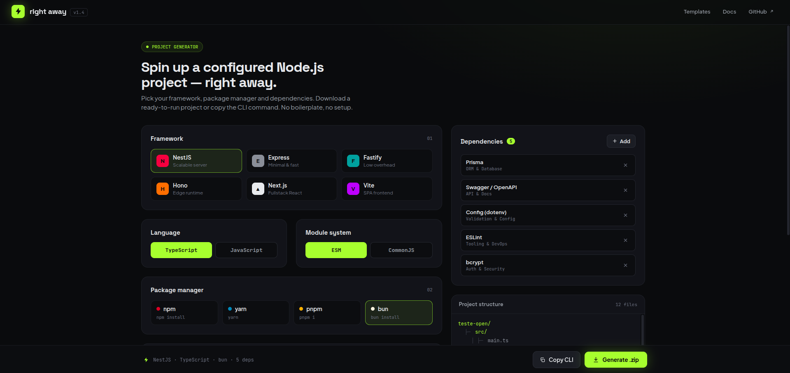

# right away

> Spin up a configured Node.js project — right away.

A community-driven project generator. Pick your framework, package manager and dependencies, then download a ready-to-run project or copy the CLI command. No boilerplate, no setup.



---

## The problem

Every Node.js project starts the same way: create the folder, init the package manager, install the framework, wire up TypeScript, add the ORM, configure linting, set up Docker, write the `.env.example`... Before writing a single line of business logic, you've burned 30 minutes on scaffolding you've done dozens of times before.

## The solution

Right Away gives you a web interface where you make all those decisions visually and get back a `.zip` you can unzip and start coding immediately. Everything is pre-configured and wired together — `tsconfig.json`, `package.json`, folder structure, config files for every tool you picked.

---

## How it works

1. **Choose your framework** — NestJS, Express, Fastify, Hono, Next.js or Vite
2. **Pick your language** — TypeScript or JavaScript
3. **Select a module system** — ESM or CommonJS
4. **Choose a package manager** — npm, yarn, pnpm or bun
5. **Fill in project metadata** — name, description, version, author, license, Node version
6. **Add dependencies** from the catalog — ORM, auth, validation, testing, caching, tooling and more
7. **Preview the file structure** live as you configure
8. **Generate .zip** — download the project ready to run

---

## Monorepo structure

```
right-away/
├── apps/
│   ├── web/          # React + Vite frontend
│   └── api/          # Node.js + Express backend
├── packages/
│   └── shared/       # TypeScript types shared between apps
├── spec/
│   ├── overview.md
│   ├── frontend/
│   │   ├── components.md
│   │   └── flows.md
│   ├── backend/
│   │   ├── api.md
│   │   └── generator.md
│   └── catalog/
│       └── dependencies.md
└── README.md
```

---

## Tech stack

| Layer     | Technology                        |
|-----------|-----------------------------------|
| Frontend  | React, Vite, TypeScript           |
| Backend   | Node.js, Express, TypeScript      |
| Zip gen   | archiver + Handlebars templates   |
| Monorepo  | pnpm workspaces                   |

---

## Spec-driven development

All features are specced in `/spec` before implementation. Each markdown file describes the contract — component props, API endpoints, generator behavior — so the intent is always clear and separate from the code.

---

## Getting started

```bash
# Install dependencies
pnpm install

# Run frontend + backend in parallel
pnpm dev

# Frontend → http://localhost:5173
# Backend  → http://localhost:3001
```

---

## Contributing

This is a community project. If you want to add a framework, a new dependency to the catalog, or improve a template, open a PR — contributions are welcome.
